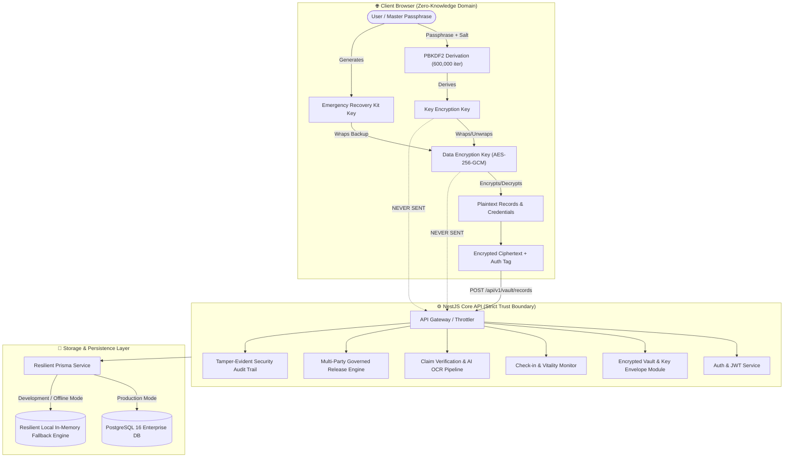

# 🔐 LegacyLock — Zero-Knowledge Digital Inheritance & Asset Custody Platform

<p align="center">
  
  
  
  
  
  
  <a href="LICENSE"></a>
</p>

---

## 📖 Executive Summary

**LegacyLock** is a mission-critical digital estate planning and automated custody handover platform. It solves the critical problem of orphaned digital assets, lost crypto wallets, hidden bank accounts, and inaccessible legal documents in the event of unforeseen incapacitation or death.

Through **client-side Zero-Knowledge Cryptography (ZK)**, sensitive records and master keys are encrypted directly in the user's browser before ever touching server infrastructure. An automated multi-channel heartbeat protocol continuously monitors user vitality, triggering a governed, multi-stage escalation and proof-of-death verification workflow before releasing assets to designated nominees.

---

## 🏛️ System Architecture



---


---

## 🎥 Demonstration Video

An automated end-to-end product walkthrough (~35 seconds) showcasing all core flows:
- **Video File**: [\legacylock_demo_30s.mp4\](legacylock_demo_30s.mp4) (High-Definition 720p)
- **WebM Format**: [\legacylock_demo_30s.webm\](legacylock_demo_30s.webm)

Key Milestones Demonstrated:
1. Landing Page & Zero-Knowledge Architecture
2. User Registration & Session Initialization
3. Master Passphrase & PBKDF2 Key Derivation (600,000 rounds)
4. Multi-Shard Cryptographic Recovery Kit
5. Encrypted Asset Vault Dashboard (Bank, Crypto, Deeds)
6. Client-Side Financial Asset Ingestion
7. Vitality Heartbeat Policy & Inactivity Cadence
8. Vitality Check-In Confirmation (I'm Alive)
9. Trusted Nominees & Cryptographic SHA-256 Invitations
10. Proof-of-Demise AI OCR Document Review
11. Multi-Party Quorum Approval & Watermarked Handover
12. Tamper-Evident Immutable Security Audit Log

## 🌟 Core Pillars & Key Features

### 1. 🛡️ Zero-Knowledge Client-Side Cryptography
- **Client-Side Key Derivation**: High-iteration PBKDF2 (`600,000` rounds) combined with cryptographically secure random salts.
- **Envelope Encryption**: Unique 256-bit Data Encryption Keys (DEKs) generated per user session using the Web Crypto API (`AES-GCM-256`).
- **Cryptographic Blindness**: The server acts strictly as an untrusted blind storage provider; it never possesses plaintext passwords, KEKs, or unencrypted assets.
- **Multi-Shard Recovery Kit**: Deterministic fallback recovery keys enabling vault restoration without centralized recovery vectors.

### 2. 💓 Automated Vitality Heartbeat & Escalation Pipeline
- **Flexible Cadence**: User-configurable check-in periods (`30`, `60`, or `90` days) with strict grace windows (`7`, `14`, or `30` days).
- **Multi-Channel Dispatch**: Redundant vitality pings dispatched across Email, SMS, and Push channels.
- **Multi-Stage Escalation State Machine**:
  $$	ext{ACTIVE} \longrightarrow 	ext{REMINDER} \longrightarrow 	ext{GRACE\_PERIOD} \longrightarrow 	ext{CONTACT\_VERIFICATION} \longrightarrow 	ext{MANUAL\_REVIEW} \longrightarrow 	ext{RELEASE}$$
- **Self-Service Controls**: Instant check-in confirmation, vacation pause mode, and immediate cancellation triggers.

### 3. 📑 Claims Verification & AI Document OCR
- **Nominee Onboarding**: SHA-256 hashed cryptographic invitation tokens preventing unauthorized claimant spoofing.
- **Evidence Pipeline**: Automated death certificate ingestion with bounded AI OCR extraction, metadata verification, and cross-matching against decedent identity.
- **Claimant Dossier**: Automated compilation of verified claim records for secondary administrative or legal executor review.

### 4. 🔏 Governed Multi-Party Asset Handover
- **Quorum Approvals**: Configurable threshold approval policies requiring dual or multi-stakeholder consent.
- **Expiring Watermarked Access**: Decrypted handover dossiers are protected by time-bound, single-use, watermarked download tokens that automatically invalidate upon threshold breach.
- **Immutable Audit Logging**: Every authentication attempt, key envelope read, record modification, and claim action is recorded in an append-only audit trail.

---

## 📂 Codebase & UI Topology

The platform comprises a full-stack architecture with **51 dedicated frontend screens** and **10 specialized backend micro-modules**:

```
locklegacy/
├── DOC-20260830-WA0017/                  # Complete Production UI Suite (51 Pages)
│   ├── app.js                           # State Dispatcher & Backend API Bridge
│   ├── crypto.js                        # Zero-Knowledge Web Crypto Implementation
│   ├── legacylock_landing_page.html     # Public Marketing & Overview
│   ├── create_secure_account_desktop.html # Account Registration
│   ├── secure_sign_in_desktop.html      # Authentication & Session Initiation
│   ├── create_vault_passphrase_desktop.html # Client-Side Key Derivation Setup
│   ├── recovery_setup_desktop.html      # Emergency Recovery Kit Sharding
│   ├── encrypted_vault_desktop.html     # Vault Dashboard & Record Browser
│   ├── add_bank_record_desktop.html     # Financial Asset Ingestion
│   ├── add_crypto_record_desktop.html   # Web3 / Seed Phrase Ingestion
│   ├── check_in_configuration_desktop.html # Vitality Heartbeat Policy
│   ├── escalation_center_desktop.html   # Inactivity Escalation Monitor
│   ├── nominee_claim_dashboard_desktop.html # Claimant Portal
│   ├── death_certificate_upload_desktop.html # AI Evidence Processing
│   ├── controlled_release_approval_desktop.html # Multi-Party Release Console
│   └── audit_log_desktop.html           # Immutable Security Log Inspector
├── backend/                             # NestJS High-Performance Core API
│   ├── src/
│   │   ├── auth/                        # JWT & Bcrypt Authentication
│   │   ├── vault/                       # Encrypted Envelope & Record Storage
│   │   ├── checkin/                     # Vitality Policies & Heartbeat Engine
│   │   ├── nominee/                     # Trusted Contact Management & Invitations
│   │   ├── claim/                       # Claims Pipeline & Dossier Generation
│   │   ├── ai/                          # Document OCR & Information Extraction
│   │   ├── release/                     # Multi-Party Approvals & Download Tokens
│   │   ├── audit/                       # Append-Only Security Logging
│   │   ├── notification/                # Multi-Channel Dispatch Service
│   │   ├── prisma/                      # Resilient Dual-Mode ORM Provider
│   │   └── common/                      # Guards, Custom Decorators & Zod Pipes
│   ├── prisma/schema.prisma             # 12 Comprehensive Relational Models
│   ├── package.json
│   └── tsconfig.json
├── docker-compose.yml                   # Production PostgreSQL 16 & Redis Stack
├── start.bat                            # 1-Click Windows Production Launcher
├── start.ps1                            # 1-Click PowerShell Development Launcher
└── README.md
```

---

## 🚀 Quick Start Guide

### System Requirements
- **Node.js**: v18.0.0 or higher
- **npm**: v9.0.0 or higher
- *(Optional)* **Docker & Docker Compose** (for PostgreSQL 16 + Redis 7)

---

### Option A: One-Click Startup (Recommended for Windows)

Simply double-click `start.bat` or run in PowerShell:
```powershell
.\start.ps1
```
This utility automatically initializes the NestJS backend on `http://localhost:3000` with resilient zero-setup persistence and immediately opens the application in your default browser.

---

### Option B: Manual Setup

#### 1. Backend Initialization
```bash
# Navigate to the backend directory
cd backend

# Install project dependencies
npm install

# Copy environment variables
cp .env.example .env

# Build the TypeScript project
npm run build

# Launch the API server
node dist/main.js
```
The NestJS server will start on `http://localhost:3000/api/v1`.

#### 2. Frontend Launch
You can open `DOC-20260830-WA0017/legacylock_landing_page.html` directly in any modern browser (Chrome, Edge, Firefox, Brave), or serve it via any static server:
```bash
npx serve DOC-20260830-WA0017 -p 5500
```

---

## 🧪 Verified API Endpoints

All core API endpoints have been rigorously validated end-to-end:

| Domain | Method | Endpoint | Request Body / Parameters | Response Status |
|---|---|---|---|---|
| **Auth** | `POST` | `/api/v1/auth/register` | `{ email, password, fullName, country, timezone }` | `201 Created` |
| **Auth** | `POST` | `/api/v1/auth/login` | `{ email, password }` | `200 OK` |
| **Auth** | `POST` | `/api/v1/auth/refresh` | `Bearer <refreshToken>` | `200 OK` |
| **Vault** | `POST` | `/api/v1/vault/setup` | `{ wrappedDek, dekIv, passphraseSalt, kdfIterations }` | `201 Created` |
| **Vault** | `POST` | `/api/v1/vault/unlock` | *(Authenticated Session)* | `200 OK` |
| **Vault** | `POST` | `/api/v1/vault/records` | `{ category, encryptedPayload, payloadIv, tags }` | `201 Created` |
| **Vault** | `GET` | `/api/v1/vault/records` | *(Authenticated Session)* | `200 OK` |
| **Check-In** | `GET` | `/api/v1/checkin/policy` | *(Authenticated Session)* | `200 OK` |
| **Check-In** | `PUT` | `/api/v1/checkin/policy` | `{ frequencyDays, gracePeriodDays, channels }` | `200 OK` |
| **Check-In** | `POST` | `/api/v1/checkin/confirm` | `{ channel, deviceMetadata }` | `200 OK` |
| **Nominees** | `POST` | `/api/v1/nominees` | `{ name, email, phone, relationship, role }` | `201 Created` |
| **Nominees** | `POST` | `/api/v1/nominees/:id/invite`| *(Nominee UUID)* | `201 Created` |
| **Claims** | `POST` | `/api/v1/claims` | `{ escalationCaseId, claimantId }` | `201 Created` |
| **Claims** | `POST` | `/api/v1/claims/:id/evidence`| `{ documentPath, documentType }` | `200 OK` |
| **Release** | `POST` | `/api/v1/release/:id/token` | `{ scope, approverId }` | `201 Created` |

---

## 🔐 Security & Threat Model

| Potential Threat | Mitigating Architectural Defense |
|---|---|
| **Database Compromise / Insider Threat** | All record payloads, account numbers, and seed phrases are encrypted client-side using AES-256-GCM. The database only stores ciphertext and initialization vectors. |
| **Credential Stuffing / Brute Force** | Passwords hashed with Bcrypt (12 cost rounds). Vault key derivation uses PBKDF2 with 600,000 iterations. |
| **Premature Asset Release** | Strict multi-stage state transitions with mandatory grace periods, verified claimant cryptographic tokens, and multi-party approval policies. |
| **Fraudulent Proof of Demise** | AI OCR document sanity checking paired with mandatory human review workflows before final decryption token generation. |
| **Unaccountable Actions** | Append-only audit events recording actor identity, IP address, timestamp, resource ID, and cryptographic result codes. |

---

## 📄 License

This project is licensed under the **MIT License (OSI Approved)** — see the [LICENSE](LICENSE) file for details.

```
MIT License - Copyright (c) 2026 Rohi56u (LegacyLock Project)
Open Source Initiative (OSI) Approved License
```
